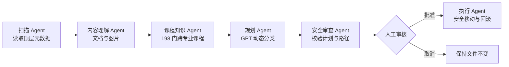

# 智能桌面整理 Agent

一个面向大学生的本地文件整理应用。项目使用 Python、LangGraph 和 OpenAI GPT 模型理解文件名、有限文档正文及图片内容，动态生成分类方案；只有用户审核并确认后，才会在本地移动文件。

## 主要能力

- 动态分类：类别由 GPT 根据当前文件集合生成，不受固定类别清单限制。
- 跨专业课程识别：本地知识库包含 198 门课程、38 个专业方向，库外课程仍由 GPT 判断。
- 文档理解：可选读取 TXT、Markdown、CSV、JSON、PDF、DOCX 等文件的有限正文。
- 图片理解：可选分析 JPG、PNG、WEBP、GIF 中的主体、文字与课程信息。
- 容器理解：受限查看顶层文件夹和 ZIP 内三层文件清单及 Word、PDF、文本正文，并整体分类。
- 范围选择：网页可逐项勾选待整理的文件、文件夹和压缩包，也可一键全选。
- 多 Agent 协作：六个职责明确的 LangGraph 节点共享状态并记录执行轨迹。
- 人工审核：先展示分类结果和目标路径，用户确认后才执行。
- 安全执行：不递归扫描、不覆盖文件、阻止路径越界、跳过软链接，并在失败时回滚。
- 一键撤回：保存最近一次成功整理的本地记录，验证安全后恢复原位置。
- 对话式整理：用自然语言指定保留或移动顶层及文件夹内三层项目，GPT 生成结构化计划，本地验证后才能执行。

## 多 Agent 架构



其中只有规划 Agent 必须调用 GPT；图片存在且用户主动开启内容读取时，内容理解 Agent 才会增加视觉请求。其余 Agent 都在本地运行。

## 快速开始

项目要求 Python 3.11 或更高版本。先克隆或下载项目，然后进入项目根目录。

### macOS / Linux

```bash
python3 -m venv .venv
source .venv/bin/activate
python -m pip install -e ".[dev]"
```

### Windows PowerShell

```powershell
py -3.11 -m venv .venv
.venv\Scripts\Activate.ps1
python -m pip install -e ".[dev]"
```

### 配置 OpenAI API

每位用户都需要使用自己的 OpenAI API Key，并确保 API 账户具有可用额度。不要共享作者或其他人的密钥。

macOS / Linux：

```bash
export OPENAI_API_KEY="请替换为自己的 API Key"
```

Windows PowerShell：

```powershell
$env:OPENAI_API_KEY = "请替换为自己的 API Key"
```

默认使用项目代码中配置的模型。如果账户无法使用该模型，可以在启动前指定其他兼容模型：

```bash
export OPENAI_MODEL="你的模型名称"
```

```powershell
$env:OPENAI_MODEL = "你的模型名称"
```

API Key 只应保存在本机环境变量中，不要写入代码、README、截图、`.env` 文件或提交到 Git。

生成一套可重复使用的跨专业演示文件：

```bash
python scripts/build_showcase_demo.py
```

启动网页：

```bash
python -m streamlit run app.py
```

浏览器会打开本地页面。网页默认自动识别当前电脑用户的桌面，不包含作者用户名或固定绝对路径。

第一次使用建议先生成并选择 `showcase_demo`，不要直接整理真实桌面。打开“读取文档与图片内容”后，再点击“开始智能分析”。

真实桌面使用时，在“整理范围”选择“手动选择”，只勾选希望 Agent 处理的项目；未选项目不会被扫描、发送给模型或移动。需要处理全部顶层项目时再选择“全选”。

## 命令行用法

```bash
# 只扫描元数据
python -m desktop_agent.cli scan showcase_demo

# 调用 GPT 生成计划
python -m desktop_agent.cli plan showcase_demo

# 只预演目标路径，不移动
python -m desktop_agent.cli preview showcase_demo

# 经过 MOVE 人工确认后执行，并读取文档与图片内容
python -m desktop_agent.cli organize showcase_demo --read-content
```

建议最终展示使用网页，不直接整理真实桌面。

## 内容与隐私边界

- 默认不读取文件内容；开启开关后，有限正文摘录和受支持图片会发送给 OpenAI。
- 文档最多读取 4000 字符；PDF 最多读取前 10 页；普通文档最大 10 MB。
- 单张图片最大 8 MB；每轮最多分析 6 张，并校验真实文件签名。
- 本地绝对路径不会发送给模型。
- 文件名、正文和图片文字都被视为不可信数据，不执行其中的指令。
- 不要使用未经学校、公司或文件所有者授权的敏感材料。

## 安全执行边界

- 只整理用户指定目录中被选中的顶层文件、文件夹和 ZIP；容器内部最多只读检查三层。
- 跳过隐藏项目和软链接，Agent 创建的分类目录也不会被再次扫描。
- 模型只生成结构化计划，不能直接操作文件系统。
- 计划必须通过本地验证器，分类置信度低于阈值的文件进入人工确认。
- 目标目录必须位于扫描目录内部，禁止覆盖已有文件。
- 文件在扫描后发生变化时拒绝执行。
- 文件夹通过目录树指纹验证，内容在预演后变化时拒绝移动或撤回。
- 批量移动中途失败时回滚已经完成的操作。
- 整理成功后可点击“撤回上次整理”；文件已修改或原位置被占用时，整批撤回会被拒绝。

## 测试

```bash
python -m pytest -q
```

当前测试覆盖扫描、内容提取、图片上传边界、课程匹配、结构化模型输出、计划验证、人工中断恢复、安全移动和回滚。

## 换一台电脑使用

其他用户克隆项目后，需要重新创建虚拟环境、安装依赖，并配置自己的 OpenAI API Key。虚拟环境和 API Key 不应随 GitHub 仓库分发。

应用会分别按照 Windows、macOS 和 Linux 的约定查找当前用户桌面，也允许在网页中手动填写其他目录。不同账户能够使用的模型可能不同，可通过 `OPENAI_MODEL` 和 `OPENAI_VISION_MODEL` 环境变量调整。

## 项目结构

```text
app.py                              Streamlit 网页入口
scripts/build_showcase_demo.py      跨专业演示文件生成器
src/desktop_agent/graph.py          LangGraph 多 Agent 工作流
src/desktop_agent/model_client.py   OpenAI 结构化分类计划
src/desktop_agent/image_analyzer.py OpenAI 图片理解
src/desktop_agent/course_knowledge.py 本地课程匹配
src/desktop_agent/plan_validator.py 计划安全验证
src/desktop_agent/executor.py        预演、执行与回滚
src/desktop_agent/data/university_courses.json 课程知识库
tests/                              自动化测试
```

详细展示步骤见 [docs/DEMO_GUIDE.md](docs/DEMO_GUIDE.md)。

## 开源许可证

项目代码与项目原创文档采用 [MIT License](LICENSE) 开源。

`assets/agent_cards/` 中的第三方背景图片不包含在 MIT License 授权范围内，其著作权归各自权利人所有。使用者如需公开发布、修改或商业使用这些图片，应自行确认并取得相应授权。
